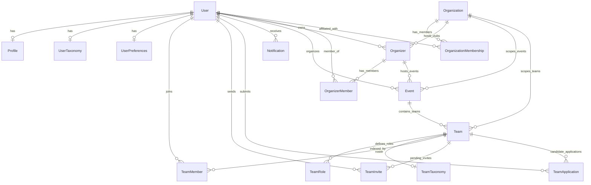

# Database Architecture

## Database Technology

SquadUp uses **Serverless PostgreSQL on Neon** (pooled connection endpoint), managed entirely through the **Prisma ORM**.
It utilizes deterministic knowledge hierarchies, decoupled taxonomy join tables, dynamic team role modeling, durable notification queuing, and modular database seeding for high-performance team matchmaking.

## Schema Overview

The absolute source of truth for the database is `apps/api/prisma/schema.prisma`.



---

### 1. `User`
- **Purpose:** The core identity of a person in the platform.
- **Fields:**
  - `id`: Internal `cuid()`. Primary key used across all foreign key relations.
  - `clerkId`: Unique string mapping to Clerk authentication.
  - `email`: User's primary email address (unique).
  - `name`: User's full display name.
  - `imageUrl`: Optional avatar image URL.
  - `createdAt`, `updatedAt`: Timestamps.
- **Relationships:** Has one `Profile`, `UserTaxonomy`, and `UserPreferences`; belongs to many `TeamMember`s; sends many `TeamInvite`s; owns `Organizer` and `Event` records; holds `OrganizerMember` and `OrganizationMembership` memberships; submits `TeamApplication`s; receives `Notification`s.

---

### 2. `Profile`
- **Purpose:** Stores the rich candidate developer profile for a user.
- **Fields:**
  - `id`: Internal `cuid()`.
  - `userId`: Foreign key to `User` (1:1, `onDelete: Cascade`).
  - `university`: Name of the user's institution (synchronized from `OrganizationMembership`).
  - `title`: Developer headline / role title (e.g. "Full Stack Engineer").
  - `summary`: Bio / executive summary (sanitized to first-person voice).
  - `skills`: String array of self-reported skills (e.g. `["React", "FastAPI", "PostgreSQL"]`).
  - `education`: JSON array of education history (`[{ degree, college }]`).
  - `experience`: JSON array of formal corporate employment (`[{ role, company, duration, bullet_points, technologies }]`).
  - `achievements`: JSON array of hackathon victories and honors (`[{ title, organization, award_tier, year, description, technologies }]`).
  - `projects`: JSON array of software projects (`[{ name, description, bullet_points, technologies }]`).
  - `githubUrl`, `linkedinUrl`: Social and portfolio links.
  - `resumePdfPath`: URI in Neon S3 Object Storage (`s3://resumes/:userId.pdf`) or local path fallback (`uploads/resumes/:userId.pdf`).
  - `resumeOriginalName`: Original filename of uploaded resume.
  - `lastResumeUploadedAt`: Timestamp of the most recent resume upload (used for 24h upload cooldown).
- **Relationships:** Belongs to one `User`.

---

### 3. `UserTaxonomy`
- **Purpose:** Decoupled technical capability and verifiable evidence index for recommendations.
- **Fields:**
  - `id`: Internal `cuid()`.
  - `userId`: Foreign key to `User` (1:1, `onDelete: Cascade`).
  - `taxonomyNodeIds`: String array of canonical taxonomy graph node IDs (e.g. `["react", "fastapi", "docker"]`).
  - `rawSkills`: Original input skill strings for auditing.
  - `evidence`: JSON array of `TaxonomyEvidenceItem` capturing source section (`skills`, `projects`, `experience`), concrete snippet text, and aggregated strength weight (`0.65` to `1.00`).
- **Relationships:** 1:1 relation with `User`.

---

### 4. `Organization` (University)
- **Purpose:** Represents an academic institution mapped to a Clerk Organization for institutional isolation.
- **Fields:**
  - `id`: Internal `cuid()`.
  - `clerkOrgId`: Unique string matching Clerk Organization ID (e.g., `org_2N38...`).
  - `name`: University name (e.g. "Stanford University").
  - `slug`: Unique lowercase URL slug (e.g. `stanford`).
  - `domain`: Official email domain (e.g. `stanford.edu`).
  - `logoUrl`: Official crest / logo URL.
  - `location`: Campus city/state location.
- **Relationships:** Has many `Organizer` student clubs, `OrganizationMembership` members, `Event`s, and `Team`s.

---

### 5. `OrganizationMembership`
- **Purpose:** Tracks a user's verified university affiliation and role.
- **Fields:**
  - `id`: Internal `cuid()`.
  - `clerkMemberId`: Unique Clerk membership identifier.
  - `organizationId`: Foreign key to `Organization`.
  - `userId`: Foreign key to `User`.
  - `role`: Role string (`org:admin`, `org:member`).
- **Constraints:** `@@unique([organizationId, userId])`.

---

### 6. `Organizer` (University Sub-Organizers / Clubs / Societies)
- **Purpose:** Represents student clubs, technical societies, or hackathon committees (e.g., "ACM at UCLA").
- **Fields:**
  - `id`: Internal `cuid()`.
  - `name`: Club name.
  - `slug`: Unique URL slug.
  - `description`, `website`, `email`, `logoUrl`: Metadata.
  - `orgId`: Clerk Organization ID (parent University).
  - `organizationId`: Foreign key to `Organization` (optional).
  - `ownerId`: Foreign key to the User who created the club (`onDelete: SetNull`).
- **Relationships:** Belongs to `Organization` (optional), owned by `User`, has many `OrganizerMember`s and hosted `Event`s.

---

### 7. `OrganizerMember`
- **Purpose:** Role-based membership join table for student clubs.
- **Fields:**
  - `id`: Internal `cuid()`.
  - `organizerId`: Foreign key to `Organizer`.
  - `userId`: Foreign key to `User`.
  - `role`: "ADMIN" | "MEMBER". Admins have full event management rights.
- **Constraints:** `@@unique([organizerId, userId])`.

---

### 8. `Event`
- **Purpose:** Represents a hackathon, project fair, or conference.
- **Fields:**
  - `id`: Internal `cuid()`.
  - `title`, `description`, `date`, `location`: Core event details.
  - `organizerId`: Contact lead `User` (`onDelete: SetNull`).
  - `organizerProfileId`: Optional link to hosting `Organizer` club.
  - `orgId`: Optional Clerk Organization ID for university scoping.
  - `organizationId`: Optional link to `Organization`.
  - `isGlobal`: Boolean. If true, students from all universities can participate.
- **Relationships:** Organized by `User`, optionally associated with `Organizer` and `Organization`; has many `Team`s.

---

### 9. `Team`
- **Purpose:** A group of students forming a squad for an event.
- **Fields:**
  - `id`: Internal `cuid()`.
  - `name`: Squad name.
  - `eventId`: Foreign key to parent `Event`.
  - `orgId`: Inherited Clerk Organization scoping.
  - `organizationId`: Foreign key to `Organization` (optional).
  - `requirements`: String array of general team requirements.
  - `university`: Team's university affiliation.
- **Relationships:** Belongs to `Event`; has one `TeamTaxonomy`; has many `TeamRole`s, `TeamMember`s, `TeamInvite`s, and `TeamApplication`s.

---

### 10. `TeamRole`
- **Purpose:** Represents designated, structured positions within a squad (e.g., *Frontend Developer*, *AI / ML Specialist*, *DevOps Lead*).
- **Fields:**
  - `id`: Internal `cuid()`.
  - `teamId`: Foreign key to `Team` (`onDelete: Cascade`).
  - `title`: Role title (e.g. "Frontend Architect").
  - `skills`: String array of required technologies/skills for this role.
  - `spots`: Integer count of open spots for this position (defaults to 1; 0 indicates role is fully claimed).
  - `assignedToId`: Optional foreign key to `User` who filled this position.
- **Relationships:** Belongs to `Team`; referenced by `TeamInvite`.
- **Indexes:** `@@index([teamId])`.

---

### 11. `TeamTaxonomy`
- **Purpose:** Decoupled technical requirement and role index for high-speed matchmaking.
- **Fields:**
  - `id`: Internal `cuid()`.
  - `teamId`: Foreign key to `Team` (1:1, `onDelete: Cascade`).
  - `requirementNodeIds`: String array of canonical taxonomy nodes pre-resolved from overall requirements.
  - `rawRequirements`: Original input requirement strings.
  - `roleTaxonomies`: JSON array of `{ roleId, roleTitle, requirementNodeIds, rawSkills }` for role-level precision matching.
- **Relationships:** 1:1 relation with `Team`.

---

### 12. `TeamMember`
- **Purpose:** Join table managing active team rosters and leader designations.
- **Fields:**
  - `id`: Internal `cuid()`.
  - `teamId`: Foreign key to `Team`.
  - `userId`: Foreign key to `User`.
  - `role`: Role designation (e.g., "Leader", "Member").
  - `joinedAt`: Timestamp.
- **Constraints:** `@@unique([teamId, userId])`.

---

### 13. `TeamInvite`
- **Purpose:** Tracks role-based invitations sent by team leaders.
- **Fields:**
  - `id`: Internal `cuid()`.
  - `teamId`: Foreign key to `Team`.
  - `roleId`: Optional foreign key to designated `TeamRole`.
  - `roleTitle`: Snapshot of assigned role title.
  - `roleSkills`: String array snapshot of required technologies for the assigned role.
  - `senderId`: Foreign key to inviting `User`.
  - `email`: Recipient email address.
  - `status`: "PENDING" | "ACCEPTED" | "DECLINED".
  - `createdAt`: Timestamp.
- **Constraints:** `@@unique([teamId, email])`.

---

### 14. `TeamApplication`
- **Purpose:** Join table managing candidate join requests.
- **Fields:**
  - `id`: Internal `cuid()`.
  - `teamId`: Foreign key to `Team`.
  - `userId`: Foreign key to candidate `User`.
  - `message`: Optional application cover note.
  - `status`: "PENDING" | "ACCEPTED" | "REJECTED" | "WITHDRAWN".
  - `createdAt`, `updatedAt`: Timestamps.
- **Constraints:** `@@unique([teamId, userId])`.

---

### 15. `UserPreferences`
- **Purpose:** Stores user-specific appearance settings, notification configurations, and default matching preferences.
- **Fields:**
  - `id`: Internal `cuid()`.
  - `userId`: Foreign key to `User` (1:1, `onDelete: Cascade`).
  - `themeMode`: "light" | "dark" | "system" (default: "system").
  - `palettePreset`: "default" | "midnight" | "emerald" | "slate" | "custom".
  - `primaryColor`: Optional custom brand hex override (e.g. `"#2563eb"`).
  - `bannerConfig`: JSON storing `{ type: "gradient" | "image" | "default", gradient?: { color1, color2, angle }, imageUrl?: string, syncTheme: boolean }`.
  - `emailNotifications`, `teamInvitesNotification`, `applicationUpdates`, `eventNotifications`, `marketingEmails`: Granular boolean toggles.
  - `defaultCampusOnly`: Boolean setting to pre-filter squad searches to the user's university.
  - `openToCollaboration`: Boolean availability flag for squad recruiters.
  - `preferredRoles`: String array of preferred role tags (e.g. `["Frontend", "AI / ML"]`).
- **Relationships:** 1:1 relation with `User`.

---

### 16. `Notification`
- **Purpose:** Durable in-app notification store with TTL expiration and real-time push.
- **Fields:**
  - `id`: Internal `cuid()`.
  - `userId`: Foreign key to recipient `User` (`onDelete: Cascade`).
  - `type`: "TEAM_INVITE" | "APPLICATION_RECEIVED" | "APPLICATION_ACCEPTED" | "APPLICATION_REJECTED" | "TEAM_JOINED" | "EVENT_ANNOUNCEMENT" | "PROFILE_UPDATED".
  - `title`, `message`: Display text.
  - `link`: Optional navigation target (e.g. `"/team/t-123?inviteId=inv-456"`).
  - `data`: JSON payload containing context (`{ teamId, inviteId, roleId, roleTitle, roleSkills, eventId, eventTitle, senderName }`).
  - `isRead`: Boolean read status (default: false).
  - `expiresAt`: Optional TTL timestamp.
  - `createdAt`, `updatedAt`: Timestamps.
- **Indexes:** `@@index([userId, isRead])`, `@@index([userId, createdAt])`, `@@index([expiresAt])`.

---

## Modular Database Seeding Architecture (`apps/api/prisma/seeds/`)

The database seeding infrastructure is completely decoupled into domain-focused modules with zero hardcoded personal Clerk IDs:

```
apps/api/prisma/
├── schema.prisma               # Source of truth for database models
├── seed.ts                     # Master orchestrator: table wipes, seed execution & cache purge
└── seeds/
    ├── organizations.seed.ts   # 6 verified universities + 14 student clubs / organizers
    ├── users.seed.ts           # 24 simulated students + profiles + offline deterministic taxonomies
    ├── events.seed.ts          # 19 campus-scoped and global hackathons
    └── teams.seed.ts           # 62 squads + structured roles + team taxonomies + candidate applications
```

- **Run Modular Seed:**
  ```bash
  pnpm --filter @squadup/api run db:seed
  ```

---

## User/Auth Relationship

A critical architectural pattern in SquadUp is the decoupled Authentication model:
1. Clerk manages credentials and issues session JWTs containing `userId` (e.g., `user_2...`).
2. The database **never uses Clerk IDs as primary or foreign keys**.
3. Incoming requests resolve the Clerk ID to the internal Postgres `cuid()` via `getOrCreateUserByClerkId()`.
4. All relational join tables (`TeamMember`, `TeamApplication`, `TeamInvite`, `Notification`, etc.) strictly reference internal `User.id` foreign keys.
5. Account deletion in Clerk automatically cascades through `TeamService.handleUserDeletion`, appointing new squad leaders and preserving squad integrity without orphaned relations.

---

## Migrations & Database Management

- **Push Schema Changes:**
  ```bash
  cd apps/api
  pnpm dotenv -e ../../.env -- npx prisma db push
  pnpm dotenv -e ../../.env -- npx prisma generate
  ```
- **Prisma Studio (Interactive Database GUI):**
  ```bash
  cd apps/api
  pnpm run db:studio
  ```
- **PostgreSQL Extensions:** The database uses `previewFeatures = ["postgresqlExtensions"]` with standard relational schemas.
