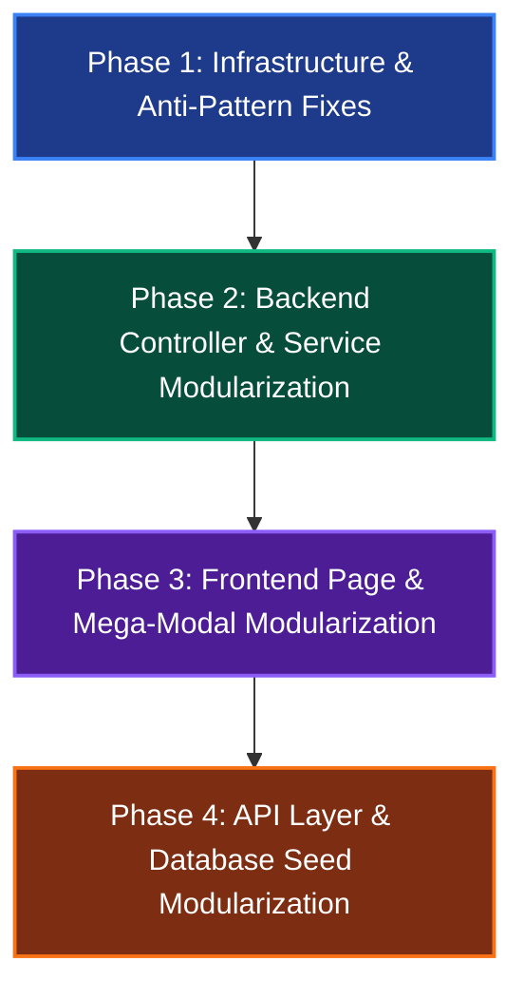

# 📋 SquadUp Codebase QA Audit & Complete Modularization Roadmap

**Document Version:** 1.0.0  
**Created:** September 2026  
**Status:** Approved for Implementation  
**Target Repository:** `main/` (`@squadup/api`, `@squadup/web`, `@squadup/shared`)

---

## 📑 Table of Contents

1. [Executive Summary & Source Metrics](#1-executive-summary--source-metrics)
2. [Oversized Files Audit Table](#2-oversized-files-audit-table)
3. [Architectural Anti-Patterns & Critical Smells](#3-architectural-anti-patterns--critical-smells)
4. [Backend (apps/api) Modularization Specification](#4-backend-appsapi-modularization-specification)
5. [Frontend (apps/web) Modularization Specification](#5-frontend-appsweb-modularization-specification)
6. [Database Seed (prisma/seed.ts) Modularization Specification](#6-database-seed-prismaseedts-modularization-specification)
7. [Step-by-Step 4-Phase Implementation Roadmap](#7-step-by-step-4-phase-implementation-roadmap)
8. [Verification & Quality Gate Protocol](#8-verification--quality-gate-protocol)

---

## 1. Executive Summary & Source Metrics

A holistic code quality and modularity audit of the **SquadUp** monorepo revealed that while the project is functionally rich and passes static type checks, several core modules suffer from severe **god-object anti-patterns**, extreme file sizes, duplicated logic, and mixed architectural concerns.

### Key Monorepo Metrics
- **Total Source Files:** 120 files (65 primary TypeScript/TSX source files across `apps/` and `packages/`).
- **Total Lines of Code:** ~24,500+ lines.
- **Files > 1,000 Lines:** 7 files accounting for **10,576 lines** (over 43% of the entire codebase).
- **Files > 500 Lines:** 14 files accounting for **15,674 lines** (over 63% of the entire codebase).

---

## 2. Oversized Files Audit Table

| Rank | File Path | Lines | Size (KB) | Domain Area | Key Responsibilities Crammed |
| :--- | :--- | :---: | :---: | :--- | :--- |
| **#1** | [`apps/api/src/controllers/team.controller.ts`](file:///e:/Programming/Projects%202026/Squad%20Up/main/apps/api/src/controllers/team.controller.ts) | **2,728** | 84.0 | Backend API | 22 endpoints: Team CRUD, roster, invites, applications, recommendations, cache, raw SQL queries |
| **#2** | [`apps/web/src/pages/TeamDetailPage.tsx`](file:///e:/Programming/Projects%202026/Squad%20Up/main/apps/web/src/pages/TeamDetailPage.tsx) | **1,567** | 72.3 | Frontend Web | Team hero, roles grid, roster list, application reviewer, invite modal, score breakdowns |
| **#3** | [`apps/api/prisma/seed.ts`](file:///e:/Programming/Projects%202026/Squad%20Up/main/apps/api/prisma/seed.ts) | **1,451** | 55.7 | Database | Monolithic seed file containing hundreds of inline JSON fixtures and DB calls |
| **#4** | [`apps/web/src/pages/TeamsPage.tsx`](file:///e:/Programming/Projects%202026/Squad%20Up/main/apps/web/src/pages/TeamsPage.tsx) | **1,360** | 61.4 | Frontend Web | Multi-tier filters, staged state, campus auto-complete, split drawer inspector, pagination |
| **#5** | [`apps/web/src/components/CreateTeamModal.tsx`](file:///e:/Programming/Projects%202026/Squad%20Up/main/apps/web/src/components/CreateTeamModal.tsx) | **1,258** | 50.1 | Frontend Web | 4-step wizard, templates, dynamic role builder, skill tags, email invite drafter |
| **#6** | [`apps/web/src/pages/Profile.tsx`](file:///e:/Programming/Projects%202026/Squad%20Up/main/apps/web/src/pages/Profile.tsx) | **1,165** | 52.6 | Frontend Web | Own profile vs. candidate profile view, experience list, projects, skills, custom SVGs |
| **#7** | [`apps/web/src/components/EditProfileModal.tsx`](file:///e:/Programming/Projects%202026/Squad%20Up/main/apps/web/src/components/EditProfileModal.tsx) | **1,047** | 44.6 | Frontend Web | Resume dropzone, manual profile editor, banner designer with gradient angle picker |
| **#8** | [`apps/web/src/services/api.ts`](file:///e:/Programming/Projects%202026/Squad%20Up/main/apps/web/src/services/api.ts) | **925** | 27.8 | Frontend Web | 11 API namespaces + ~300 lines of duplicate types already present in `@squadup/shared` |
| **#9** | [`apps/web/src/components/SmartRecommendationPanel.tsx`](file:///e:/Programming/Projects%202026/Squad%20Up/main/apps/web/src/components/SmartRecommendationPanel.tsx) | **708** | 32.7 | Frontend Web | Match ring, score provenance breakdown, role fit, action buttons |
| **#10** | [`apps/web/src/pages/PlaygroundPage.tsx`](file:///e:/Programming/Projects%202026/Squad%20Up/main/apps/web/src/pages/PlaygroundPage.tsx) | **659** | 28.4 | Frontend Web | Monolithic taxonomy testing playground |
| **#11** | [`apps/api/src/controllers/organizer.controller.ts`](file:///e:/Programming/Projects%202026/Squad%20Up/main/apps/api/src/controllers/organizer.controller.ts) | **565** | 15.6 | Backend API | University Organizations + Sub-Organizers (Clubs/Societies) in one controller |
| **#12** | [`apps/web/src/components/UserPreferencesModal.tsx`](file:///e:/Programming/Projects%202026/Squad%20Up/main/apps/web/src/components/UserPreferencesModal.tsx) | **562** | 24.8 | Frontend Web | Theme mode, notification toggles, and matching preference forms |
| **#13** | [`apps/api/src/controllers/event.controller.ts`](file:///e:/Programming/Projects%202026/Squad%20Up/main/apps/api/src/controllers/event.controller.ts) | **542** | 16.7 | Backend API | Event CRUD, complex query filtering, caching, and notification triggers |
| **#14** | [`apps/web/src/components/Navbar.tsx`](file:///e:/Programming/Projects%202026/Squad%20Up/main/apps/web/src/components/Navbar.tsx) | **539** | 23.4 | Frontend Web | Navigation, search modal trigger, notification drawer, profile dropdown |
| **#15** | [`apps/api/src/controllers/profile.controller.ts`](file:///e:/Programming/Projects%202026/Squad%20Up/main/apps/api/src/controllers/profile.controller.ts) | **494** | 16.8 | Backend API | Profile retrieval, manual update, candidate public profile formatting |

---

## 3. Architectural Anti-Patterns & Critical Smells

### Anti-Pattern 1: PostgreSQL Connection Pool Exhaustion (10 `new PrismaClient()` calls)
- **Problem:** `new PrismaClient()` is instantiated independently in 10 different files (`team.controller.ts`, `event.controller.ts`, `organizer.controller.ts`, `profile.controller.ts`, `webhook.controller.ts`, `resume.controller.ts`, `preferences.controller.ts`, `auth.utils.ts`, `notification.service.ts`, `ai.queue.ts`).
- **Impact:** In Node.js, each client instance creates a separate connection pool (defaulting to 5-10 database connections). This rapidly exhausts Postgres `max_connections`, introduces memory leaks, and impairs connection pooling.
- **Solution:** Implement a shared singleton client at `apps/api/src/lib/prisma.ts`.

### Anti-Pattern 2: God Controller (`team.controller.ts` with 2,728 Lines)
- **Problem:** One single file handles 22 distinct routes across 4 functional domains (Team CRUD, Invitations, Applications, Recommendations). It directly performs Prisma queries, calculates capacity, manages Redis caching, publishes notifications, and dispatches BullMQ background jobs.
- **Solution:** Break into 4 domain-focused controllers (`team.controller.ts`, `application.controller.ts`, `invite.controller.ts`, `recommendation.controller.ts`) and back them with dedicated domain services.

### Anti-Pattern 3: Missing Service Layer
- **Problem:** Route handlers contain heavy SQL queries, capacity computations, cache serialization, and email logic directly inside Express `(req, res)` handlers.
- **Solution:** Extract domain services (`team.service.ts`, `application.service.ts`, `invite.service.ts`, `event.service.ts`, `organization.service.ts`).

### Anti-Pattern 4: Monolithic Frontend Pages
- **Problem:** `TeamDetailPage.tsx` (1,567 lines), `TeamsPage.tsx` (1,360 lines), and `Profile.tsx` (1,165 lines) contain entire component sub-trees, complex state machines, inline modal markup, custom SVG icons, and inline styles in one file.
- **Solution:** Extract presentational subcomponents, custom hooks (`useTeamDetail`, `useTeamsFilter`, `useProfile`), and shared icon/utility modules.

### Anti-Pattern 5: Mega-Modals Bundling Unrelated Workflows
- **Problem:** `CreateTeamModal.tsx` (1,258 lines) bundles a 4-step wizard with preset templates and role spot builders. `EditProfileModal.tsx` (1,047 lines) bundles resume PDF uploading, manual field editing, and banner theme styling.
- **Solution:** Deconstruct wizards into dedicated step subcomponents (`StepSelectEvent`, `StepTeamDetails`, `StepRoleBuilder`, `StepInviteMembers`) and split modals by intent.

### Anti-Pattern 6: Redundant DTO Types in `apps/web/src/services/api.ts`
- **Problem:** Over 300 lines of DTO interfaces (`EventItem`, `TeamItem`, `UserProfileResponse`, `PaginatedResponse`, etc.) in `apps/web/src/services/api.ts` duplicate `@squadup/shared`.
- **Solution:** Re-export canonical interfaces directly from `@squadup/shared` and split the 925-line API file into domain API modules.

### Anti-Pattern 7: Duplicated Utilities & Social Icons
- **Problem:** Social SVGs (`GithubIcon`, `LinkedinIcon`), URL normalizers (`formatGithubUrl`, `formatLinkedinUrl`), and timestamp helpers (`formatTimeAgo`) are copy-pasted across 4+ files.
- **Solution:** Extract into `src/utils/date.utils.ts`, `src/utils/url.utils.ts`, and `src/components/icons/SocialIcons.tsx`.

---

## 4. Backend (`apps/api`) Modularization Specification

### 4.1 Target Directory Architecture
```
apps/api/src/
├── lib/
│   └── prisma.ts                        <-- [NEW] Singleton PrismaClient export
├── controllers/
│   ├── team.controller.ts               <-- Core Team CRUD & settings (~250 lines)
│   ├── application.controller.ts        <-- [NEW] Team applications & reviews (~200 lines)
│   ├── invite.controller.ts             <-- [NEW] Team invitations & responses (~180 lines)
│   ├── recommendation.controller.ts     <-- [NEW] Recommendations & role fits (~150 lines)
│   ├── event.controller.ts              <-- Cleaned event endpoints (~200 lines)
│   ├── organization.controller.ts       <-- [NEW] University organizations (~120 lines)
│   ├── organizer.controller.ts          <-- Sub-organizers (clubs/societies) (~150 lines)
│   ├── profile.controller.ts            <-- User profiles (~200 lines)
│   └── webhook.controller.ts            <-- Clerk webhook handlers (~200 lines)
├── services/
│   ├── team.service.ts                  <-- [NEW] Team DB queries, capacity, mutations
│   ├── application.service.ts           <-- [NEW] Apply, withdraw, accept/reject logic
│   ├── invite.service.ts                <-- [NEW] Invite creation, validation, email dispatch
│   ├── event.service.ts                 <-- [NEW] Event scoping, campus filtering, popularity
│   ├── organization.service.ts          <-- [NEW] University org logic & memberships
│   ├── notification.service.ts          <-- Notification dispatching
│   ├── cache.service.ts                 <-- Redis cache wrapper
│   ├── email.service.ts                 <-- Email templates & delivery
│   └── ai.service.ts                    <-- Resume parsing & taxonomy synthesis
└── utils/
    ├── date.utils.ts                    <-- [NEW] formatTimeAgo & timestamp helpers
    └── auth.utils.ts                    <-- Uses singleton Prisma client
```

### 4.2 Controller Breakdown Details
1. **`team.controller.ts`**:
   - `listTeams`, `getTeamById`, `createTeam`, `updateTeam`, `deleteTeam`, `leaveTeam`, `removeTeamMember`.
2. **`application.controller.ts`**:
   - `applyToTeam`, `withdrawApplication`, `withdrawApplicationById`, `getMyApplications`, `getIncomingApplications`, `getApplicationById`, `getTeamApplications`, `acceptApplication`, `rejectApplication`.
3. **`invite.controller.ts`**:
   - `sendTeamInvites`, `getMyInvites`, `acceptInvite`, `declineInvite`, `cancelInvite`.
4. **`recommendation.controller.ts`**:
   - `getRecommendations`.
5. **`organization.controller.ts`**:
   - `createOrganization`, `listOrganizations`, `getOrganizationByClerkId`, `selectUniversity`.
6. **`organizer.controller.ts`**:
   - `createOrganizer`, `listOrganizers`, `getOrganizerById`, `updateOrganizer`, `addOrganizerMember`, `removeOrganizerMember`.

---

## 5. Frontend (`apps/web`) Modularization Specification

### 5.1 Target Directory Architecture
```
apps/web/src/
├── api/                                 <-- Modular API client layer (replaces 925-line api.ts)
│   ├── client.ts                        <-- Base fetch client & Clerk JWT resolver
│   ├── teams.api.ts                     <-- Teams & roster endpoints
│   ├── applications.api.ts              <-- Application endpoints
│   ├── invites.api.ts                   <-- Invite endpoints
│   ├── events.api.ts                    <-- Event endpoints
│   ├── profile.api.ts                   <-- Profile endpoints
│   ├── preferences.api.ts               <-- User preferences endpoints
│   ├── organizers.api.ts                <-- University & Organizer endpoints
│   ├── resume.api.ts                    <-- Resume upload & parse endpoints
│   ├── recommendations.api.ts           <-- AI recommendation endpoints
│   └── index.ts                         <-- Unified re-export for backward compatibility
├── pages/
│   ├── TeamDetailPage/                  <-- Modularized from 1,567-line file
│   │   ├── TeamDetailPage.tsx           <-- Thin container page (~200 lines)
│   │   ├── components/
│   │   │   ├── TeamHero.tsx             <-- Header, status, match score, quick actions
│   │   │   ├── TeamRolesGrid.tsx        <-- Open roles & spot cards
│   │   │   ├── TeamRoster.tsx           <-- Member table & remove actions
│   │   │   ├── TeamApplicationsList.tsx <-- Candidate review & accept/reject
│   │   │   └── TeamInviteForm.tsx       <-- Send role invite inline form
│   │   └── hooks/
│   │       └── useTeamDetail.ts         <-- Data loading, permissions, actions hook
│   ├── TeamsPage/                       <-- Modularized from 1,360-line file
│   │   ├── TeamsPage.tsx                <-- Main layout (~180 lines)
│   │   ├── components/
│   │   │   ├── TeamsFilterBar.tsx       <-- Filter popovers, chips, sorting
│   │   │   ├── CampusSearchSelect.tsx   <-- Campus search & auto-complete
│   │   │   └── TeamInspectorDrawer.tsx  <-- Split-view inspection drawer
│   │   └── hooks/
│   │       └── useTeamsFilter.ts        <-- Filter state & pagination hook
│   └── Profile/                         <-- Modularized from 1,165-line file
│       ├── Profile.tsx                  <-- Page container (~150 lines)
│       └── components/
│           ├── ProfileHeader.tsx        <-- Avatar, title, university, social links
│           ├── ProfileSkillsSection.tsx <-- Verified skill badges & taxonomy
│           ├── ProfileExperience.tsx    <-- Work & project items
│           └── ProfileSquads.tsx        <-- Joined squads & applications
├── components/
│   ├── modals/
│   │   ├── create-team/                 <-- Modularized from 1,258-line modal
│   │   │   ├── CreateTeamModal.tsx      <-- Wizard container (~120 lines)
│   │   │   ├── StepSelectEvent.tsx      <-- Step 1
│   │   │   ├── StepTeamDetails.tsx      <-- Step 2 (with template selector)
│   │   │   ├── StepRoleBuilder.tsx      <-- Step 3 (dynamic role spots)
│   │   │   └── StepInviteMembers.tsx    <-- Step 4 (optional invites)
│   │   ├── edit-profile/                <-- Modularized from 1,047-line modal
│   │   │   ├── EditProfileModal.tsx     <-- Modal shell
│   │   │   ├── ManualEditForm.tsx       <-- Form fields
│   │   │   └── BannerCustomizer.tsx     <-- Gradient & banner controls
│   │   └── preferences/
│   │       ├── UserPreferencesModal.tsx <-- Tab wrapper
│   │       ├── ThemePreferencesTab.tsx
│   │       └── NotificationPreferencesTab.tsx
│   ├── badges/                          <-- Split from 435-line Badges.tsx
│   │   ├── RecommendationBadge.tsx
│   │   ├── ScopeBadge.tsx
│   │   ├── SkillTag.tsx
│   │   └── index.ts
│   └── icons/
│       └── SocialIcons.tsx              <-- Reusable GithubIcon, LinkedinIcon
└── utils/
    ├── url.utils.ts                     <-- formatGithubUrl, formatLinkedinUrl
    └── date.utils.ts                    <-- formatTimeAgo
```

---

## 6. Database Seed (`prisma/seed.ts`) Modularization Specification

### 6.1 Target Seed Architecture
```
apps/api/prisma/
├── seed.ts                              <-- Compact orchestration script (~150 lines)
└── fixtures/
    ├── organizations.json               <-- 4 verified university orgs + seed campuses
    ├── sub_organizers.json              <-- Student clubs & chapters
    ├── users.json                       <-- Seed candidates with resumes & profiles
    ├── events.json                      <-- Hackathons & tech challenges
    └── teams.json                       <-- Seed squads with structured roles
```

---

## 7. Step-by-Step 4-Phase Implementation Roadmap



### ⚡ Phase 1: High-Risk Infrastructure & Anti-Pattern Fixes (P0)
- **Goal:** Eliminate database connection exhaustion, establish shared utilities, and remove duplicate type definitions.
- **Key Tasks:**
  1. Create `apps/api/src/lib/prisma.ts` singleton and replace all 10 `new PrismaClient()` instances.
  2. Create shared utilities: `apps/web/src/utils/date.utils.ts`, `apps/web/src/utils/url.utils.ts`, `apps/web/src/components/icons/SocialIcons.tsx`.
  3. Clean `apps/web/src/services/api.ts` to import canonical DTOs from `@squadup/shared` and re-export them cleanly.
  4. Replace duplicated functions/icons across `Profile.tsx`, `EditProfileModal.tsx`, `TeamDetailPage.tsx`, and `CandidateApplicationTile.tsx`.
  5. Validate with `pnpm typecheck` and test suites.

---

### ⚡ Phase 2: Backend Controller & Service Modularization (P1)
- **Goal:** Break down monolithic 2,728-line `team.controller.ts` and 565-line `organizer.controller.ts` into clean, domain-scoped controllers and services.
- **Key Tasks:**
  1. Extract `apps/api/src/services/team.service.ts`, `application.service.ts`, `invite.service.ts`, and `event.service.ts`.
  2. Split `team.controller.ts` into:
     - `team.controller.ts` (CRUD, roster)
     - `application.controller.ts` (applications)
     - `invite.controller.ts` (invites)
     - `recommendation.controller.ts` (recommendation queries)
  3. Split `organizer.controller.ts` into `organization.controller.ts` (Universities) and `organizer.controller.ts` (Clubs/Societies).
  4. Update `team.routes.ts`, `application.routes.ts`, `organizer.routes.ts`.
  5. Validate with `pnpm typecheck` and API tests.

---

### ⚡ Phase 3: Frontend Page & Mega-Modal Modularization (P1)
- **Goal:** Deconstruct giant frontend pages and multi-step modal dialogs into focused components and custom hooks.
- **Key Tasks:**
  1. Modularize `TeamDetailPage.tsx` (1,567 lines) into container + `useTeamDetail` hook + 5 subcomponents.
  2. Modularize `CreateTeamModal.tsx` (1,258 lines) into 4 step components.
  3. Modularize `TeamsPage.tsx` (1,360 lines) into `useTeamsFilter` hook + `TeamsFilterBar`, `CampusSearchSelect`, `TeamInspectorDrawer`.
  4. Modularize `EditProfileModal.tsx` (1,047 lines) and `Profile.tsx` (1,165 lines).
  5. Modularize `Badges.tsx` (435 lines) into `components/badges/`.
  6. Validate with `pnpm typecheck` and web build.

---

### ⚡ Phase 4: API Client & Database Seed Modularization (P2 - Completed ✅)
- **Goal:** Modularize database seed infrastructure into clean modular files with zero hardcoded personal accounts.
- **Key Tasks Completed:**
  1. Extracted `apps/api/prisma/seeds/organizations.seed.ts` (6 verified universities + 14 student clubs).
  2. Extracted `apps/api/prisma/seeds/users.seed.ts` (24 simulated students + profiles + offline deterministic taxonomies).
  3. Extracted `apps/api/prisma/seeds/events.seed.ts` (19 campus-scoped and global hackathons).
  4. Extracted `apps/api/prisma/seeds/teams.seed.ts` (62 squads + structured roles + team taxonomies + candidate applications).
  5. Refactored `apps/api/prisma/seed.ts` into a clean orchestrator with table wipes, sequential execution, and Redis cache purging.
  6. Verified complete execution via `pnpm --filter @squadup/api run db:seed`.

---

## 8. Verification & Quality Gate Protocol

To ensure 100% zero regressions at each phase:

| Check | Command | Success Criteria |
| :--- | :--- | :--- |
| **Workspace Typecheck** | `pnpm typecheck` | 0 errors across `@squadup/shared`, `@squadup/api`, `@squadup/web` |
| **Backend Test Suite** | `pnpm --filter @squadup/api test` | All taxonomy and parser tests pass |
| **Frontend Production Build** | `pnpm --filter @squadup/web build` | Vite build succeeds without bundle or chunk errors |
| **Database Seed Integrity** | `pnpm --filter @squadup/api db:seed` | Seed fixtures populate database cleanly |
